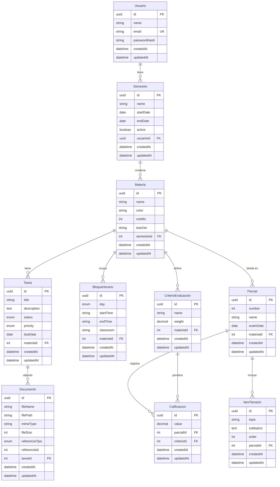

# StudyBoard — Esquema de Base de Datos

Diagrama entidad-relación completo del sistema. Generado a partir de la especificación oficial del modelo de datos.

---

---

## Notas del diagrama

- `weight` en `CriterioEvaluacion` es `decimal(5,2)` — representa el porcentaje de ponderación (p. ej. `30.00` para 30 %).
- `value` en `Calificacion` es `decimal(5,2)` — permite escala 0–100 con decimales.
- `startTime` y `endTime` en `BloqueHorario` se almacenan como cadena `HH:mm` (p. ej. `"08:00"`). No se usa tipo `TIME` de SQL para mantener compatibilidad con SQLite y facilitar la serialización JSON.
- `Documento.referenciaId` es un campo polimórfico genérico que apunta al id de la entidad referenciada (tarea o parcial) según `referenciaTipo`. La FK tipada solo existe en `tareaId` (nullable); el parcial se referencia solo mediante `referenciaTipo = 'parcial'` y `referenciaId`.
- El modelo completo se gestiona con TypeORM sobre SQLite. En desarrollo se usa `synchronize: true`; en producción se usan migraciones explícitas.
